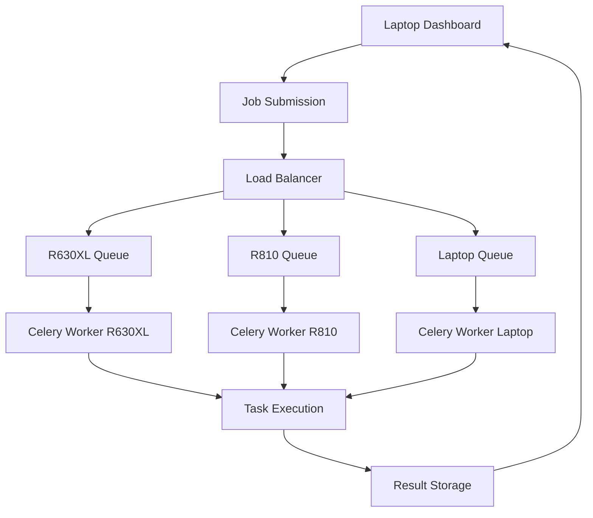

# 🚀 QuantTime Distributed Computing Cluster - Complete Deployment Guide

This guide will help you deploy your **QuantTime Quant Homelab** across your R630XL and R810 servers with **minimal manual setup**. Both servers will be able to handle **ANY task type** - data normalization, feature engineering, model training, and backtesting.

## 📋 Prerequisites

### Hardware Setup
- **Laptop**: Control center (Windows/Linux/Mac)
- **R630XL**: 16 cores, 64GB RAM (Ubuntu 22.04 Server)
- **R810**: 32 cores, 256GB RAM (Ubuntu 22.04 Server)
- **Network**: All machines on same network, R630XL ↔ R810 connected via ethernet cable

### Required Information
Before starting, gather:
- **R630XL IP address**: e.g., `jupiter`
- **R810 IP address**: e.g., `saturn`
- **Username**: on both servers (we'll use `quanttime`)
- **Sudo access**: on both servers

## 🎯 Quick Deployment (5 Steps)

### Step 1: Prepare Your Laptop

```bash
# Clone/navigate to your QuantTime project
cd QuantTime

# Install dependencies
pip install -r requirements.txt

# Run the quick deployment script
bash server/setup/quick_deploy.sh
```

**Select Option 1** (Local only) to set up your laptop first.

### Step 2: Configure Server Details

Edit `server/config/servers.json` with your actual server information:

```json
{
  "laptop": {
    "name": "Laptop Control Center",
    "ip_address": "laptop",
    "username": "your_laptop_username"
  },
  "r630xl": {
    "name": "R630XL Workhorse",
    "ip_address": "jupiter",
    "username": "quanttime",
    "specs": {
      "cpu_cores": 16,
      "memory_gb": 64
    }
  },
  "r810": {
    "name": "R810 Power Workhorse", 
    "ip_address": "saturn",
    "username": "quanttime",
    "specs": {
      "cpu_cores": 32,
      "memory_gb": 256
    }
  }
}
```

### Step 3: Deploy to Servers

```bash
# Automated deployment to both servers
python server/setup/configure_servers.py setup
```

This will:
- ✅ Set up SSH keys
- ✅ Copy the entire project to both servers
- ✅ Install all dependencies automatically
- ✅ Configure services
- ✅ Start the distributed computing system

### Step 4: Configure Environment

Set your API keys in `.env`:

```bash
# Edit .env file
DATABENTO_API_KEY=your_databento_api_key_here
QUANTTIME_SERVER_HOST=0.0.0.0
QUANTTIME_SERVER_PORT=8000
```

### Step 5: Launch Your Cluster

```bash
# Start the dashboard
streamlit run quanttime/dashboard/app.py
```

**🎉 Your distributed computing cluster is now live!**

Access your dashboard at `http://localhost:8501` and click the **"Servers"** tab to see your cluster.

---

## 🛠️ Manual Setup (If Needed)

### Server Preparation

On each server (R630XL and R810):

#### 1. Create User and Basic Setup

```bash
# SSH into server
ssh your_user@jupiter  # or .102 for R810

# Create quanttime user
sudo useradd -m -s /bin/bash quanttime
sudo usermod -aG sudo quanttime
sudo passwd quanttime

# Switch to quanttime user
sudo su - quanttime
```

#### 2. Install Dependencies

```bash
# Update system
sudo apt update && sudo apt upgrade -y

# Install required packages
sudo apt install -y python3 python3-pip python3-venv git curl wget
sudo apt install -y build-essential libssl-dev libffi-dev
sudo apt install -y redis-server postgresql postgresql-contrib
sudo apt install -y nginx supervisor htop

# Start services
sudo systemctl enable redis-server postgresql nginx
sudo systemctl start redis-server postgresql nginx
```

#### 3. Set Up Project

```bash
# Create project directory
sudo mkdir -p /opt/quanttime
sudo chown quanttime:quanttime /opt/quanttime

# Copy project from laptop (run from laptop)
rsync -avz --exclude='.git' --exclude='__pycache__' \
    QuantTime/ quanttime@jupiter:/opt/quanttime/

# On server: Install Python dependencies
cd /opt/quanttime
python3 -m venv .venv
source .venv/bin/activate
pip install -r requirements.txt
```

#### 4. Configure Services

```bash
# Run the installation script
sudo bash server/setup/install.sh

# Start QuantTime services  
bash server/scripts/start_server.sh
```

### Network Configuration

#### 1. Update Hosts Files

Add to `/etc/hosts` on all machines:

```bash
laptop laptop
jupiter r630xl
saturn r810
```

#### 2. SSH Key Setup

```bash
# On laptop: Generate and copy SSH keys
ssh-keygen -t rsa -b 4096 -f ~/.ssh/id_rsa
ssh-copy-id quanttime@r630xl
ssh-copy-id quanttime@r810
```

#### 3. Firewall Configuration

```bash
# On each server
sudo ufw allow ssh
sudo ufw allow 8000/tcp  # QuantTime API
sudo ufw allow 6379/tcp  # Redis
sudo ufw allow 5432/tcp  # PostgreSQL
sudo ufw enable
```

---

## 🔧 System Architecture

### Process Overview

| Component | Purpose | Technology |
|-----------|---------|------------|
| **Redis** | Task queue & caching | In-memory database |
| **Celery** | Distributed task processing | Python task queue |
| **FastAPI** | Server API endpoints | Modern Python web framework |
| **PostgreSQL** | Data persistence | Relational database |
| **File Sync** | Real-time file synchronization | Custom rsync-based system |
| **WebSocket** | Real-time dashboard updates | Bidirectional communication |

### Task Queue System



### File Synchronization

- **Real-time sync** between all nodes
- **Ethernet direct connection** between R630XL ↔ R810
- **WiFi/Network sync** for laptop
- **Conflict resolution** with latest-wins strategy
- **Incremental updates** for efficiency

## 📊 Using Your Cluster

### Dashboard Features

#### Left Sidebar - Server Control Center
- **🎯 Server Selector**: Choose laptop/R630XL/R810 for job targeting
- **🌐 Connection Status**: Live status indicators
- **📊 Resource Usage**: Real-time CPU/memory/disk usage
- **📋 Job Queue**: Active jobs with progress bars
- **🔄 File Sync**: Synchronization status

#### Main "Servers" Tab
- **Server Grid**: Visual status of all servers
- **Performance Charts**: Historical resource usage
- **Job Management**: Submit and monitor jobs
- **File Browser**: Manage files across cluster

### Job Distribution

**All servers can handle ANY task type:**

```python
# Examples of flexible job routing

# Data normalization - routes to least loaded server
submit_job("data_normalization", {
    "input_path": "data/AAPL_raw.parquet",
    "output_path": "data/AAPL_normalized.parquet"
})

# Feature engineering - goes to optimal server
submit_job("feature_engineering", {
    "symbol": "AAPL",
    "features": ["technical", "order_flow"]
})

# Model training - prefers high-memory servers
submit_job("model_training", {
    "model_type": "lightgbm",
    "dataset": "features/AAPL_features.parquet",
    "target_server": "r810"  # Optional: force specific server
})

# Backtesting - distributed automatically
submit_job("backtest", {
    "strategy": "mean_reversion",
    "symbols": ["AAPL", "MSFT", "GOOGL"]
})
```

### Smart Load Balancing

The system automatically:
- **Routes jobs** to least loaded servers
- **Prefers R810** for memory-intensive tasks (>16GB)
- **Falls back** to alternative servers if primary is busy
- **Monitors resources** and rejects jobs if servers overloaded

## 🔒 Security Features

### Authentication
- **JWT tokens** for API authentication
- **SSH key-based** server communication
- **API keys** for external services

### Network Security
- **Firewall rules** automatically configured
- **Encrypted transfers** for file sync
- **Secure WebSocket** connections

### Access Control
- **User isolation** with dedicated `quanttime` user
- **File permissions** properly configured
- **Service isolation** with SystemD

## 📈 Monitoring & Health Checks

### Automatic Monitoring
- **System resources** (CPU, memory, disk, network)
- **Service health** (APIs, databases, workers)
- **Job performance** (execution times, success rates)
- **File sync status** (conflicts, transfer rates)

### Alerting
Automatic alerts for:
- High resource usage (>80% CPU, >85% memory)
- Service failures
- Network connectivity issues
- Job failures or timeouts

### Recovery Actions
- **Automatic service restart** on failure
- **Job redistribution** if server goes offline
- **Cache clearing** for memory issues
- **Temporary file cleanup** for disk space

## 🔧 Troubleshooting

### Common Issues

#### 1. Server Connection Failed
```bash
# Check SSH connectivity
ssh quanttime@r630xl
ssh quanttime@r810

# Check service status
systemctl status quanttime-*

# Restart services
sudo systemctl restart quanttime-*
```

#### 2. Jobs Stuck in Queue
```bash
# Check Celery workers
celery -A server.scripts.celery_app inspect active

# Check Redis connection
redis-cli ping

# Restart worker
sudo systemctl restart quanttime-celery-worker
```

#### 3. File Sync Issues
```bash
# Check sync status via API
curl http://r630xl:8000/api/v1/files/sync/status

# Check network connectivity
ping r630xl
ping r810

# Restart sync service
sudo systemctl restart quanttime-monitoring
```

#### 4. High Resource Usage
```bash
# Check system resources
htop
df -h
free -h

# Check QuantTime processes
ps aux | grep quanttime

# Clean temporary files
find /tmp -name "*.tmp" -mtime +1 -delete
```

### Log Files

Check these logs for debugging:

| Service | Log Location |
|---------|-------------|
| Main Server | `/opt/quanttime/logs/server.log` |
| Data Collector | `/opt/quanttime/logs/data_collector.log` |
| Monitoring | `/opt/quanttime/logs/monitoring.log` |
| Celery Worker | `/opt/quanttime/logs/celery.log` |
| System Logs | `journalctl -u quanttime-*` |

### Performance Tuning

#### For R630XL (16 cores, 64GB)
```bash
# Optimize Celery workers
export QUANTTIME_MAX_WORKERS=12
export QUANTTIME_BATCH_SIZE=500

# Memory settings
export QUANTTIME_CACHE_SIZE=8GB
```

#### For R810 (32 cores, 256GB)  
```bash
# Maximize worker processes
export QUANTTIME_MAX_WORKERS=24
export QUANTTIME_BATCH_SIZE=2000

# Memory settings
export QUANTTIME_CACHE_SIZE=32GB
```

## 🎯 Quick Commands Reference

### Deployment Commands
```bash
# Initial setup
bash server/setup/quick_deploy.sh

# Full server deployment
python server/setup/configure_servers.py setup

# Check cluster status
python server/setup/configure_servers.py status

# Restart all services
ssh quanttime@r630xl 'bash /opt/quanttime/server/scripts/start_server.sh'
ssh quanttime@r810 'bash /opt/quanttime/server/scripts/start_server.sh'
```

### Monitoring Commands
```bash
# Dashboard
streamlit run quanttime/dashboard/app.py

# Server status
curl http://r630xl:8000/api/v1/server/health
curl http://r810:8000/api/v1/server/health

# Job queue status
curl http://r630xl:8000/api/v1/jobs
curl http://r810:8000/api/v1/jobs
```

### Service Management
```bash
# Start services
sudo systemctl start quanttime-*

# Stop services  
sudo systemctl stop quanttime-*

# Check status
sudo systemctl status quanttime-*

# View logs
journalctl -u quanttime-celery-worker -f
```

## 🎉 Success Indicators

You'll know your cluster is working when:

- ✅ **Dashboard shows all servers online** (green indicators)
- ✅ **Jobs can be submitted** to any server
- ✅ **Files sync automatically** between all machines
- ✅ **Resource usage** is displayed in real-time
- ✅ **Load balancing** distributes jobs optimally
- ✅ **Progress bars** show job execution status

## 🚀 What You've Built

**Congratulations!** You now have a **production-grade distributed computing cluster** that:

- **Distributes workloads** automatically across 3 machines
- **Handles any task type** on any server (no restrictions)
- **Syncs files** in real-time between all nodes
- **Monitors performance** and health continuously
- **Balances load** intelligently based on resources
- **Recovers automatically** from failures
- **Provides beautiful dashboard** for control and monitoring

Your **QuantTime Quant Homelab** is now a **true high-performance computing cluster**! 🔥

## 📞 Support

If you encounter issues:

1. **Check logs** in `/opt/quanttime/logs/`
2. **Test connectivity** between servers
3. **Verify services** are running with `systemctl status quanttime-*`
4. **Check resource usage** with `htop` and `df -h`
5. **Restart services** if needed

The system is designed to be **self-healing** and **robust**, but proper monitoring ensures optimal performance.

---

**🎯 Your distributed computing cluster is ready to handle serious quantitative trading workloads!**
