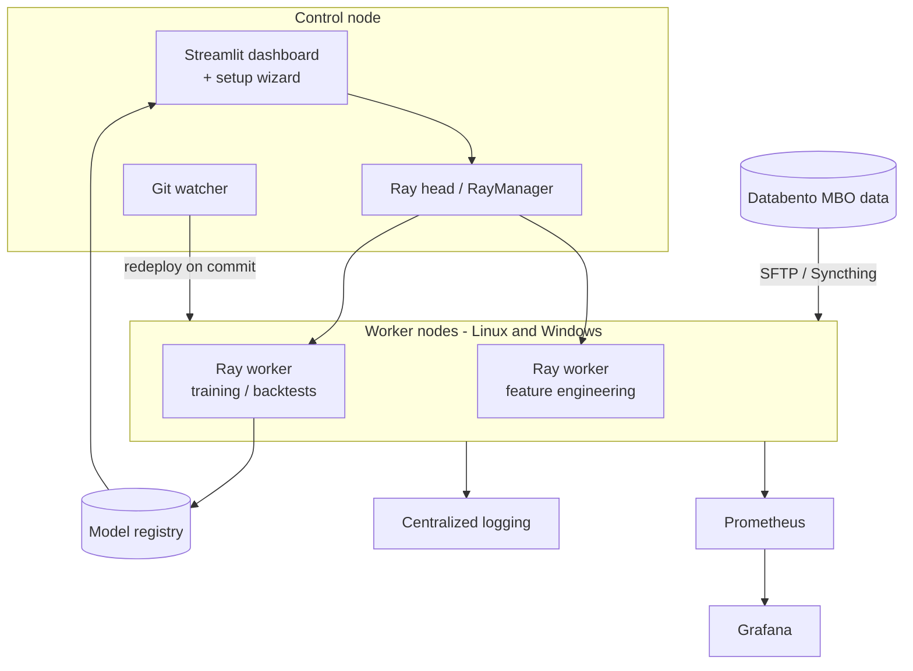

# QuantTimeCloud

**The multi-node edition of QuantTime.** It is an ES-futures Level-3 (MBO) ML research suite with a distributed layer added: a Ray cluster, cross-platform (Windows and Linux) node management, automated code and data sync, and Prometheus/Grafana monitoring. With it, a laptop drives feature engineering, training and backtests on a home-lab cluster.

> **Project status:** research prototype from late August 2025, forked from QuantTime. It is kept as a portfolio piece and is not maintained. Its ideas carried into **[Lvl3Quant](https://github.com/njliautaud/Lvl3Quant)**: ES Level-3 order-book modeling, Ray-based distributed compute and walk-forward validation. Lvl3Quant is where that research continues.

---

## What it adds over QuantTime

| Area | QuantTimeCloud additions |
|---|---|
| **Cluster compute** | `RayManager` for head and worker lifecycle and job submission; `DynamicClusterManager` with node roles, state and topology; key exchange between nodes |
| **Cross-platform nodes** | `CrossPlatformNodeManager` health checks for Windows and Linux; PowerShell deployment for Windows nodes; SSH-based setup for Ubuntu nodes |
| **Code and data sync** | Git watcher that redeploys on new commits; SFTP manager for large data files; Syncthing and peer-sync options |
| **Automation** | Smart setup with network scanning, SSH key management, predictive health monitoring and zero-touch node deployment |
| **Observability** | Centralized logging across nodes; Prometheus and Grafana stack (`docker-compose.monitoring.yml`) with a QuantTime overview dashboard |
| **Models** | Common `ModelBase` interface and model registry, used by LightGBM (tabular and MBO-specific), LSTM, temporal CNN (TCN) and Transformer models |
| **Microstructure** | `MicrostructureAnalyzer` (book dynamics and latency metrics); `OrderFlowClassifier` that labels flow as toxic, benign, institutional, market-maker or neutral |
| **Execution** | Order-book matching backtester (`realistic_mbo_backtest_engine.py`) with order status, partial fills and fills priced from the book; rule-based trade engine that detects order-flow patterns (iceberg orders, order blocks, absorption, large resting levels, reversals) and trades a single ES contract |
| **UI** | Streamlit setup wizard, plus pages for nodes, Ray, SFTP, sync, monitoring, the hybrid pipeline and enhanced backtests |

Everything else is inherited from QuantTime:

- Databento MBO loaders and the order-book processor
- order-flow feature engineering
- session-aware splits (Asia, London, New York, overnight)
- GPU- and memory-optimized training
- the FastAPI and Celery job server
- the tick-level backtester

## Architecture



Everything runs over a private mesh VPN between the nodes; no ports are exposed publicly.

## Tech stack

Python 3.11 · Ray · Databento · pandas / NumPy / PyArrow · PyTorch · LightGBM · scikit-learn · Streamlit + Plotly · FastAPI · Celery + Redis · SQLAlchemy / PostgreSQL · Paramiko (SSH/SFTP) · Syncthing · Prometheus + Grafana · Docker Compose · Poetry

## Repository structure

| Path | Contents |
|---|---|
| `quanttime/core/` | Ray, cluster, node, Git-sync, SFTP, Syncthing, peer-sync and automation managers; centralized logging |
| `quanttime/adapter/`, `quanttime/data/` | Databento loaders, MBO processor, normalization, bars, schemas, memory-optimized loading |
| `quanttime/features/` | Order-flow, MBO, microstructure and flow-classification features; feature selection |
| `quanttime/models/` | Model base class, registry and storage; LightGBM, LSTM, TCN, Transformer; trade engine |
| `quanttime/ml/` | GPU- and memory-optimized training; hybrid prediction pipeline |
| `quanttime/backtest/` | Tick-level and order-book-matching backtest engines |
| `quanttime/dashboard/` | Streamlit app and pages for cluster, sync, monitoring and deployment |
| `server/` | FastAPI job server, Celery workers, auth, health and resource monitoring |
| `scripts/` | Setup, node deployment, sync, ingest, train, backtest and live entry points |
| `monitoring/` | Prometheus configuration and Grafana dashboards |
| `config/` | Ray, SFTP, automation and node configuration templates |
| `docs/` | Architecture, Databento/DBN, MBO Level-3 execution spec, deployment and sync guides |
| `external/` | Vendored third-party sources (see Credits) |

## Running it

```bash
python run.py install     # create .venv and install dependencies
python run.py up          # simulator + collector + dashboard (http://localhost:8501)
python run.py dashboard   # dashboard only
python run.py train | backtest | live
```

The first time the dashboard opens, it shows a setup wizard to configure the Git remote, nodes, Ray and SFTP.

- Copy `settings.example.txt` to `settings.txt` (git-ignored) and export `DATABENTO_KEY` with your own key (see `.env.example`). Secrets are read from environment variables, never from committed files.
- Node addresses and credentials are entered in the wizard; do not commit them.
- Start the monitoring stack with `docker compose -f docker-compose.monitoring.yml up`.

## Credits

- **[databento-python](https://github.com/databento/databento-python)**. Official Databento client, Apache-2.0. A copy is vendored in `external/`.
- **[TradingView Lightweight Charts](https://github.com/tradingview/lightweight-charts)**. Apache-2.0. A copy is vendored in `external/`.

## Disclaimer

This is research code for education, not investment advice. No trading performance is claimed.
